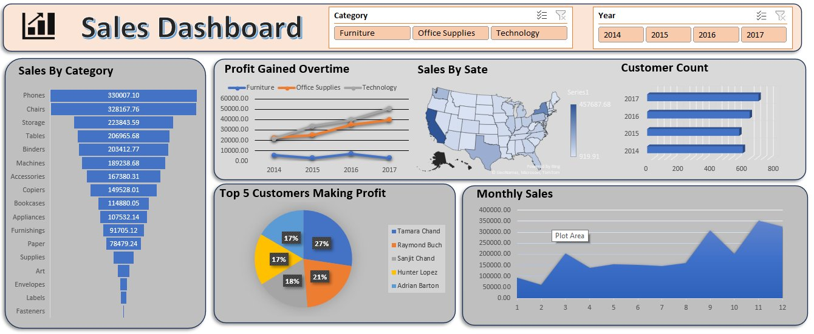

# 📊 Sales Performance Dashboard (Excel)

## Overview

An interactive sales analysis dashboard built in **Microsoft Excel**, using PivotTables and PivotCharts on a 9,994-row retail sales dataset. The dashboard tracks sales and profit trends by category, region, customer, and time period.


## Overview

An interactive sales analysis dashboard built in **Microsoft Excel**, using PivotTables and PivotCharts on a 9,994-row retail sales dataset. The dashboard tracks sales and profit trends by category, region, customer, and time period.



---

## Dataset

- **Rows:** ~9,994 individual order records
- **Fields:** Order ID, Order Date, Customer Name, Category, Sub-Category, Sales, Profit, State, etc.
- **Time Period:** 2014 – 2017

---

## What's in the Dashboard

| Section | What it Shows |
|---|---|
| **Category / Year Slicers** | Interactive filters to slice the entire dashboard by product category or year |
| **Sales by Category (Funnel)** | Sales ranked from highest (Phones) to lowest (Fasteners) across all 17 sub-categories |
| **Profit Gained Overtime (Line)** | Profit trend for Furniture, Office Supplies, and Technology from 2014–2017 |
| **Sales by State (Map)** | Geographic heat map of total sales across all US states |
| **Customer Count (Bar)** | Customer count by year, 2014–2017 |
| **Top 5 Customers (Pie)** | Share of profit from the top 5 customers by name |
| **Monthly Sales (Area)** | Sales trend across the 12 months, showing seasonal peaks |

---

## Key Insights

- **Technology is the fastest-growing category** — profit grew from $21,493 in 2014 to $50,685 in 2017, more than doubling in 4 years.
- **Furniture is the weak spot** — profit stayed flat and even dipped (from $5,470 in 2014 to just $3,018 in 2017) despite steady sales, suggesting high costs or heavy discounting.
- **Phones and Chairs are the top-selling sub-categories**, generating over $330K and $328K in sales respectively, while low-end items like Fasteners, Labels, and Envelopes barely register — a classic 80/20 sales distribution visible in the funnel chart.
- **California dominates by state**, with $457,688 in sales — visibly the darkest region on the map and more than 5x the next closest states like Florida ($89,474).
- **September is a major seasonal peak** — monthly sales jump to $307,650, more than double a typical month, suggesting a strong back-to-school/business restocking effect.
- **Customer base grew steadily year over year**, with the customer count bar chart showing consistent growth from 2014 through 2017.
- **Top 5 customers are fairly balanced**, with the leading customer (Tamara Chand) contributing 27% of their group's combined profit, and no single customer wildly dominating.

---

## Tools & Techniques Used

- **Microsoft Excel**
- PivotTables for category, state, customer, and monthly aggregations
- PivotCharts (Funnel, Line, Map, Bar, Pie, Area) for visualization
- **Slicers** for interactive filtering by Category and Year
- 3D Map chart for state-level geographic visualization
- Native Excel formulas for profit and sales summaries

---

## Files in This Repo

```
excel-sales-dashboard/
│
├── README.md
├── dashboard_screenshot.png      ← Preview image (shown above)
└── sales_dashboard.xlsx          ← Full interactive Excel file
```

---

## How to Use

1. Download `sales_dashboard.xlsx`
2. Open in Microsoft Excel (charts are built on PivotTables, fully interactive)
3. Go to the **Dashboard** sheet to view all visuals
4. Use the **Category** and **Year** slicers at the top to filter the entire dashboard live
5. Click into any PivotTable sheet (e.g. `Sales_by_state`, `Profit_Gained`) to explore the underlying numbers

---

*Project by Yash | Excel Data Analysis Portfolio Project*)

---

## Dataset

- **Rows:** ~9,994 individual order records
- **Fields:** Order ID, Order Date, Customer Name, Category, Sub-Category, Sales, Profit, State, etc.
- **Time Period:** 2014 – 2017

---

## What's in the Dashboard

| Section | What it Shows |
|---|---|
| **Category / Year Slicers** | Interactive filters to slice the entire dashboard by product category or year |
| **Sales by Category (Funnel)** | Sales ranked from highest (Phones) to lowest (Fasteners) across all 17 sub-categories |
| **Profit Gained Overtime (Line)** | Profit trend for Furniture, Office Supplies, and Technology from 2014–2017 |
| **Sales by State (Map)** | Geographic heat map of total sales across all US states |
| **Customer Count (Bar)** | Customer count by year, 2014–2017 |
| **Top 5 Customers (Pie)** | Share of profit from the top 5 customers by name |
| **Monthly Sales (Area)** | Sales trend across the 12 months, showing seasonal peaks |

---

## Key Insights

- **Technology is the fastest-growing category** — profit grew from $21,493 in 2014 to $50,685 in 2017, more than doubling in 4 years.
- **Furniture is the weak spot** — profit stayed flat and even dipped (from $5,470 in 2014 to just $3,018 in 2017) despite steady sales, suggesting high costs or heavy discounting.
- **Phones and Chairs are the top-selling sub-categories**, generating over $330K and $328K in sales respectively, while low-end items like Fasteners, Labels, and Envelopes barely register — a classic 80/20 sales distribution visible in the funnel chart.
- **California dominates by state**, with $457,688 in sales — visibly the darkest region on the map and more than 5x the next closest states like Florida ($89,474).
- **September is a major seasonal peak** — monthly sales jump to $307,650, more than double a typical month, suggesting a strong back-to-school/business restocking effect.
- **Customer base grew steadily year over year**, with the customer count bar chart showing consistent growth from 2014 through 2017.
- **Top 5 customers are fairly balanced**, with the leading customer (Tamara Chand) contributing 27% of their group's combined profit, and no single customer wildly dominating.

---

## Tools & Techniques Used

- **Microsoft Excel**
- PivotTables for category, state, customer, and monthly aggregations
- PivotCharts (Funnel, Line, Map, Bar, Pie, Area) for visualization
- **Slicers** for interactive filtering by Category and Year
- 3D Map chart for state-level geographic visualization
- Native Excel formulas for profit and sales summaries

---

## Files in This Repo

```
excel-sales-dashboard/
│
├── README.md
├── dashboard_screenshot.png      ← Preview image (shown above)
└── sales_dashboard.xlsx          ← Full interactive Excel file
```

---

## How to Use

1. Download `sales_dashboard.xlsx`
2. Open in Microsoft Excel (charts are built on PivotTables, fully interactive)
3. Go to the **Dashboard** sheet to view all visuals
4. Use the **Category** and **Year** slicers at the top to filter the entire dashboard live
5. Click into any PivotTable sheet (e.g. `Sales_by_state`, `Profit_Gained`) to explore the underlying numbers

---

*Project by Yash | Excel Data Analysis Portfolio Project*
